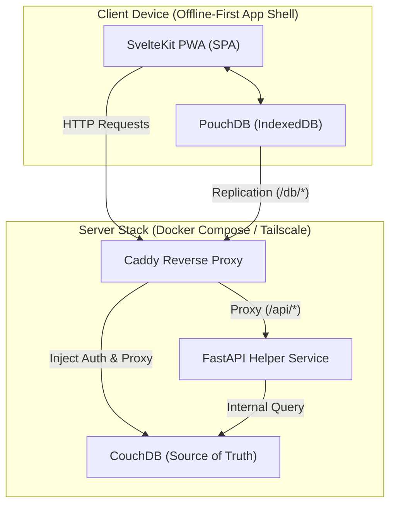

# Itinera ✈️

Itinera is a self-hosted, **offline-first** personal trip planner. Designed to work seamlessly on phones and laptops, it lets you plan itineraries, checklists, flights, and budgets completely offline. When a connection is available, it automatically synchronizes to your home server.

---

## Technical Highlights

- **Local-First Sync**: Full CRUD works offline via a client-side database (PouchDB/IndexedDB), which performs two-way replication with CouchDB when online.
- **Single-Origin Deployment**: Caddy acts as a unified entrypoint, serving the built SvelteKit SPA, injecting CouchDB admin credentials silently, and routing backend requests.
- **Privacy Centric**: Your travel data remains on your devices and your server—never exposed to third-party APIs.
- **Python Companion**: A FastAPI service manages background utilities, structured data imports, and portable JSON exports.

---

## System Architecture



---

## Directory Structure

This monorepo is organized into three distinct layers:

| Component | Technology Stack | Purpose |
| :--- | :--- | :--- |
| [**`web/`**](file:///home/brito/itinera/web) | SvelteKit, TypeScript, TailwindCSS, PouchDB | The frontend client built as a Progressive Web App (PWA). Emits a static SPA that caches assets for offline navigation. |
| [**`api/`**](file:///home/brito/itinera/api) | FastAPI, Python, CouchDB | The helper service containing backend smarts, data export hooks, and automated schema indexing. |
| [**`deploy/`**](file:///home/brito/itinera/deploy) | Docker, Caddyfile | Production runtime orchestration. Spins up Caddy, CouchDB, and the FastAPI container, binding them securely on a private network. |

---

## Getting Started

### Production Deployment (Quick Start)

The entire production stack can be run with a single command inside the `deploy/` directory.

1. Navigate to the deployment folder:
   ```bash
   cd deploy
   ```
2. Copy the environment template:
   ```bash
   cp .env.example .env
   ```
   *Make sure to change `COUCHDB_PASSWORD` inside the generated `.env`.*

3. Spin up the stack:
   ```bash
   docker compose up --build -d
   ```

The app will be accessible at `http://localhost` (or the port defined via `HOST_HTTP_PORT`). For secure remote access, running `tailscale serve --bg http://localhost:80` is highly recommended.

---

## Development Guides

For local development setup, component specifications, and deeper technical contracts, please refer to the respective subdirectories:

* 📖 [Web Frontend Development & PWA setup](file:///home/brito/itinera/web/README.md)
* 📖 [Data Sync & Offline Repositories Contract (`$lib/db`)](file:///home/brito/itinera/web/src/lib/db/README.md)
* 📖 [FastAPI Backend Development](file:///home/brito/itinera/api/README.md)
* 📖 [Production Deployment & Backups Guide](file:///home/brito/itinera/deploy/README.md)
