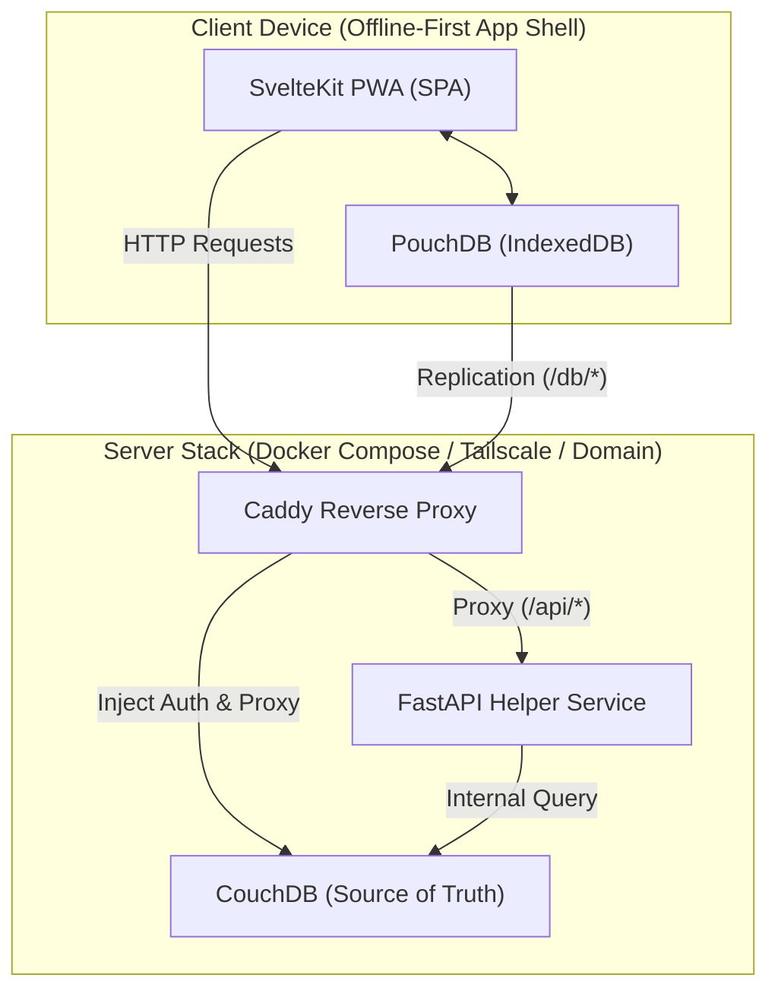

# Itinera ✈️

Itinera is a self-hosted, **offline-first** personal trip planner. Designed to work seamlessly on phones and laptops, it lets you plan itineraries, checklists, flights, and budgets completely offline. When a connection is available, it automatically synchronizes to your home server — and across every device on your network.

---

## Technical Highlights

- **Local-First Sync**: Full CRUD works offline via a client-side database (PouchDB/IndexedDB). When online, PouchDB syncs bidirectionally with CouchDB using a live, retrying replication feed. The remote URL is resolved at runtime from `window.location.origin`, so the app works identically on `localhost`, LAN IPs, and any public domain — no rebuild required.
- **Single-Origin Deployment**: Caddy acts as a unified entrypoint, serving the built SvelteKit SPA, injecting CouchDB admin credentials silently, and routing backend requests.
- **Privacy Centric**: Your travel data remains on your devices and your server — never exposed to third-party APIs.
- **Python Companion**: A FastAPI service manages background utilities, scheduled JSON exports, printable PDFs, and CouchDB housekeeping.

---

## System Architecture



---

## Directory Structure

| Component | Technology Stack | Purpose |
| :--- | :--- | :--- |
| [**`web/`**](web/) | SvelteKit, TypeScript, TailwindCSS, PouchDB | The frontend client built as a Progressive Web App (PWA). Emits a static SPA that caches assets for offline navigation. |
| [**`api/`**](api/) | FastAPI, Python ≥ 3.12, CouchDB | The helper service: health checks, JSON backups/exports, printable trip PDFs, and scheduled compaction. |
| [**`deploy/`**](deploy/) | Docker Compose, Caddy | Production runtime orchestration. Spins up Caddy, CouchDB, and the FastAPI container, binding them securely on a private Docker network. |

---

## Getting Started

### Production Deployment (Quick Start)

The entire production stack can be run with a single command inside the `deploy/` directory.

1. Navigate to the deployment folder:
   ```bash
   cd deploy
   ```
2. Copy the environment template and set a strong password:
   ```bash
   cp .env.example .env
   # Edit COUCHDB_PASSWORD — it must be changed before first run
   ```

3. Spin up the stack:
   ```bash
   docker compose up --build -d
   ```

The app will be accessible at `http://localhost` (or the port defined via `HOST_HTTP_PORT`).

### Multi-Device Sync

Because PouchDB resolves its CouchDB target URL from `window.location.origin` at runtime, syncing between devices is automatic — just open the app from the same server address on any device on your network (e.g. `http://192.168.1.x:8090`). No configuration needed.

### Custom Domain / HTTPS

Caddy issues TLS certificates automatically via Let's Encrypt. Replace `:80` in `deploy/Caddyfile` with your domain name (`itinera.yourdomain.com`), expose port `443` in `docker-compose.yml`, and point your DNS `A` record at the server. See [deploy/README.md](deploy/README.md) for the full guide.

---

## Development Guides

For local development setup, component specifications, and deeper technical contracts, please refer to the respective subdirectories:

* 📖 [Web Frontend Development & PWA setup](web/README.md)
* 📖 [Data Sync & Offline Repositories Contract (`$lib/db`)](web/src/lib/db/README.md)
* 📖 [FastAPI Backend Development](api/README.md)
* 📖 [Production Deployment & Backups Guide](deploy/README.md)
